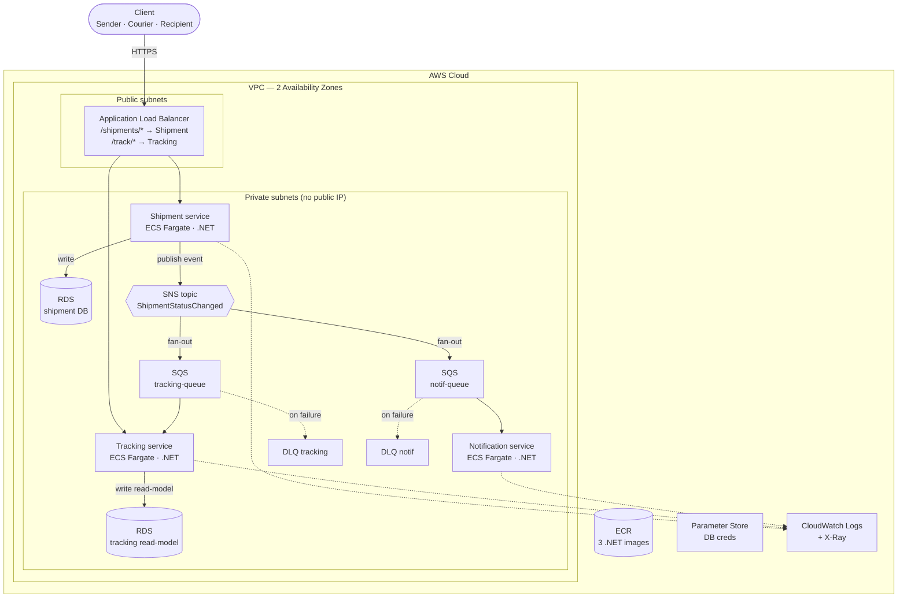

# Logistics Tracking — .NET Microservices on AWS

Hệ thống **theo dõi & giao kiện hàng chặng cuối (last-mile parcel delivery)** xây theo kiến trúc
**microservices event-driven**, mỗi service là một **Clean Architecture** độc lập, deploy trên **AWS ECS Fargate**.

> **Câu chuyện kỹ thuật:** tách đường đọc (tra cứu) khỏi đường ghi (cập nhật) vì trong last-mile khách
> tra cứu trạng thái gấp nhiều lần số lần đơn được cập nhật; gửi thông báo chạy bất đồng bộ qua hàng đợi
> để không bao giờ chặn luồng cập nhật của tài xế; các service tách rời để một service lỗi không làm sập cả hệ.

## Bài toán nghiệp vụ (value)

Last-mile là trung tâm chi phí của giao vận e-commerce. Hệ này nhắm 3 điểm đau tốn tiền thật:

| Service | Điểm đau doanh nghiệp | Giá trị |
|---|---|---|
| **Tracking** (đọc nhanh) | *"Đơn tới đâu rồi?"* — câu hỏi số 1 dội vào CSKH | Khách tự tra cứu → giảm tải hotline |
| **Notification** (báo chủ động) | Giao hụt lần đầu (người nhận vắng) → tốn giao lại | Báo trước → giảm tỉ lệ giao hụt |
| **Shipment** (nguồn sự thật) | Trạng thái sai → xử lý thủ công | Một nguồn sự thật nhất quán về vòng đời đơn |

## Kiến trúc



## Clean Architecture (mỗi service)

Dependency rule: mọi phụ thuộc **chỉ hướng vào trong**. Application định nghĩa *port* (interface),
Infrastructure hiện thực *adapter* → Domain/Application không hề biết tới AWS.

```
Api/Worker ─► Infrastructure ─► Application ─► Domain
   (DI)         (EF, SNS/SQS)     (use cases,     (entity, VO,
                                   ports, DTO)     state machine)
```

Building blocks tách theo tầng (`BuildingBlocks.Domain/Application/Infrastructure`) để dependency rule
không bao giờ bị phá. `Shared.Contracts` chứa schema **integration event** — hợp đồng duy nhất được chia
sẻ giữa các service (không share entity/DB).

## Cấu trúc thư mục

```
src/
  Services/
    Shipment/      {Domain, Application, Infrastructure, Api}
    Tracking/      {Domain, Application, Infrastructure, Api}
    Notification/  {Application, Infrastructure, Worker}   # domain mỏng → Worker, không API
  Shared/
    BuildingBlocks.Domain | Application | Infrastructure
    Shared.Contracts                                        # integration events
infra/            # AWS CDK bằng C# (M1+)
tests/            # unit test (state machine, use cases)
```

## Chạy local (M0)

Yêu cầu: **.NET 9 SDK**, **Docker Desktop**.

```bash
docker compose up --build
```

Kiểm tra:

```bash
curl http://localhost:8081/health   # shipment
curl http://localhost:8082/health   # tracking
```

Hoặc chạy thuần .NET (không Docker):

```bash
dotnet build
dotnet run --project src/Services/Shipment/Shipment.Api
```

## Roadmap (milestones)

| MS | Nội dung | Trạng thái |
|---|---|---|
| **M0** | Scaffold 4-layer × 3 service, docker-compose + LocalStack, health endpoint | ✅ |
| **M1** | CDK (C#): VPC 2 AZ, public+private subnet, 3 SG (ALB→ECS→RDS), `natGateways=0` — synth ✅ (deploy chờ AWS account) | ✅ |
| **M2** | ECR: 3 repo (scan-on-push, lifecycle giữ 5 image, destroy-clean) — synth ✅ | ✅ |
| **M3a** | Shipment domain (state machine) + EF mapping + InitialCreate migration + 5 unit test ✅ | ✅ |
| **M3b** | RDS Postgres (CDK, cross-stack VPC/SG, Secrets Manager creds, free-tier) — synth ✅ | ✅ |
| **M4** | ECS Fargate + ALB — **DEPLOYED lên AWS ✅**: 2 service .NET chạy sau ALB, target `healthy`, path routing `/shipments` `/track` verified (ap-southeast-1) | ✅ |
| **M5** | SNS/SQS + Outbox + consumer + DLQ | ⬜ |
| **M6** | CI/CD (GitHub Actions → ECR → ECS) | ⬜ |
| **M7** | CloudWatch + X-Ray + idempotency + resilience | ⬜ |
| **M8** | Unit/integration tests + docs | ⬜ |

## Cost controls

- **Thứ tốn tiền nhất không phải chọn NAT hay Endpoint — mà là để hệ chạy 24/7 quên tắt.** Kỷ luật `cdk destroy` sau mỗi buổi mới là "cost optimization" thật cho portfolio.
- VPC dựng `natGateways=0`. Đường ra internet cho private subnet (kéo ECR, log, SNS/SQS) quyết ở M4 theo 3 lựa chọn — trade-off:
  - **NAT Gateway**: ~$32/tháng + data (private thật).
  - **VPC Interface Endpoints**: ~$7/endpoint/AZ → 5–6 endpoint × 2 AZ ≈ $80+/tháng (bảo mật nhất, nhưng KHÔNG rẻ hơn NAT).
  - **Fargate ở public subnet + SG khóa**: ~$0 egress, hợp demo tear-down được (chọn cho bản demo).
- 1 RDS `db.t3.micro` free-tier, single-AZ, backup off (dev), destroy sạch.
- **Creds RDS ở Secrets Manager** (tự sinh, native RDS, ~$0.40/th) — không để plaintext trong code. Parameter Store (free) dành cho config thường, không phải mật khẩu DB.

## Tech stack

.NET 9 · ASP.NET Core · EF Core (Npgsql) · MediatR · FluentValidation · AWS ECS Fargate · ALB · RDS ·
SNS/SQS · ECR · CloudWatch/X-Ray · AWS CDK (C#) · Docker · LocalStack
